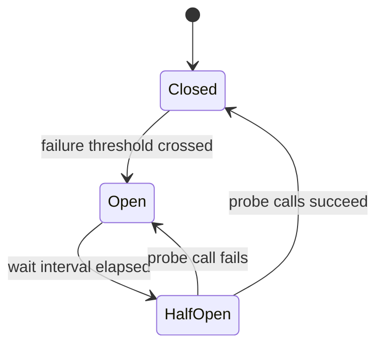

# Circuit Breaker at the Edge

## Intent

Stop repeatedly spending latency and connection capacity on a downstream service that is already failing. Return a bounded, explicit failure while allowing controlled probes for recovery.

## State model

## Apply when

- Calls cross a network boundary.
- Failure is measurable and the caller has a meaningful fallback response.
- Timeout, retry, and breaker budgets are designed together.

## Avoid when

- The operation is a local function call.
- The fallback could be mistaken for authoritative data.
- Retries can duplicate a non-idempotent side effect.

## Design checklist

- Set the downstream timeout below the caller's total request budget.
- Count only failures that mean the dependency is unavailable.
- Keep retries bounded and use jitter outside the breaker.
- Make open-state responses observable and distinguishable from domain errors.
- Test closed-to-open, open fallback, and half-open recovery behavior.

## Failure mode to watch

A circuit breaker can hide a dependency outage behind fast `503` responses. It limits propagation; it does not repair the dependency. Connect its state and fallback count to [[Service-Health-Triage]].

## Related decision

- [[ADR-0001-Explicit-Gateway-Routes]]
